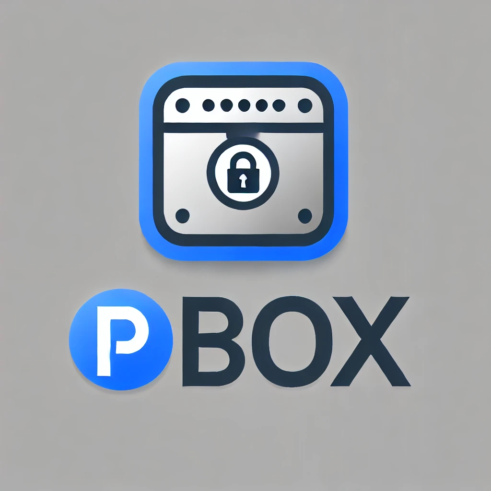

# PBox - Password Manager

PBox is an Experience killing password manager built with **PyQt5** for the GUI and **SQLite** for data storage. It provides functionalities like user authentication, password encryption, backup/restore to Google Drive, and API key management.

## Features

- **User Authentication** 
  - Secure login with hashed passwords.

- **Password Management**
  - Add, edit, and delete passwords securely.
  - Store details like URL, username/email, password, 2FA code, and notes.
  - All details are encrypted before storage, ensuring data security.

- **Encryption of Data**
  - Uses AES (Advanced Encryption Standard) for data encryption.
  - Ensures that all stored data is encrypted, making it resistant to unauthorized access.

- **Backup and Restore**
  - Encrypted database backups can be uploaded to Google Drive.
  - Backup files are encrypted, adding an extra layer of security.
  - Restore functionality allows easy recovery of encrypted data from Google Drive.
  - Google OAuth integration ensures secure access and interaction with Google Drive.
  - Local Backup and Restore.  

- **API Integration**
  - Add entries over network through API.
  - Uses RSA encryption for secure communication with APIs.

- **Database Management**
  - Uses SQLite for local storage of data.
  - Tables include **users**, **manager**, **groups**, and **API**.

- **Utilities and Helper Functions**
  - Utility functions for hashing, path management, and more.

## Files
```text
.
├── LICENSE
├── app.py
├── core
│   ├── api
│   │   ├── __init__.py
│   │   └── api.py
│   ├── database
│   │   ├── __init__.py
│   │   └── database.py
│   ├── encryption
│   │   ├── __init__.py
│   │   └── encryption.py
│   ├── tabs
│   │   ├── __init__.py
│   │   ├── add_tab.py
│   │   ├── backup_tab.py
│   │   ├── edit_tab.py
│   │   ├── info_tab.py
│   │   ├── manager_tab.py
│   │   └── settings_tab.py
│   ├── ui
│   │   ├── __init__.py
│   │   ├── login_window.py
│   │   ├── main_window.py
│   │   └── styles.py
│   └── utils
│       ├── __init__.py
│       └── utils.py
├── logo.png
├── requirements.txt
├── tools
│   ├── APITest.py
│   ├── AddUser.py
│   ├── CreateDB.py
│   └── RSAGenrator.py
```
- **`app.py`**: The main entry point of the application, initializing the PyQt5 interface and starting the app.
- **`api.py`**: Contains API-related logic, including secure API key management and request handling.
- **`database.py`**: Manages database operations (SQLite), such as creating tables, adding users, and fetching records.
- **`encryption.py`**: Provides AES encryption for sensitive data like passwords, ensuring secure storage.
- **`add_tab.py`**: Implements the UI and logic for adding new password entries.
- **`backup_tab.py`**: Handles the backup of encrypted databases to Google Drive and restoration.
- **`edit_tab.py`**: Enables editing of existing password entries.
- **`info_tab.py`**: Displays general information about the application.
- **`manager_tab.py`**: Manages existing passwords, including viewing and deleting entries.
- **`settings_tab.py`**: Provides access to application settings, such as managing API keys.
- **`login_window.py`**: Implements the login window interface.
- **`main_window.py`**: Sets up the main application window with tab navigation.
- **`styles.py`**: Defines the styles for the app, supporting themes and design elements.
- **`utils.py`**: Contains utility functions used throughout the application, such as hashing passwords.
- **`APITest.py`**: A client for testing API connections.
- **`AddUser.py`**: Adds new users to the database.
- **`CreateDB.py`**: Creates the initial SQLite database with necessary tables.
- **`RSAGenrator.py`**: Generates RSA key pairs for API secure communication.


## Setup and Installation

### Prerequisites
- Python 3.9 or later
- Virtual environment (recommended)
- Required Python packages (listed in `requirements.txt`)

### Setup

1. **Clone the Repository**:
 ```bash
 git clone https://github.com/Zeyad-Azia/PBox && cd PBox
 ```

2. **Install Dependencies**:
 ```bash
 pip install -r requirements.txt
 ```
   
3. **Create The Database**:
```python
db_path = "database_name.db"
```
change `db_path` value for the database name & path.
```bash
python3 tools/CreateDB.py # Create the Database
```

4. **Adds User to the database**:
```python
conn = sqlite3.connect('../core/PBox.db')
```
change `../core/PBox.db` value for the database path.
```bash
python3 tools/AddUser.py # Insert User into the database

Enter a username: your_username
Enter a password: your_password
```
5. **Generate RSA keys**:
```bash
python3 RSAGenrator

RSA keys generated and saved as 'private_key.pem' and 'public_key.pem'
```
6. **core/database/database.py**

```python
DB_PATH = r'database_path'
```
Change `database_path` to your database path.

7. **core/api/api.py**

```python
private_key_path = r"rsa_key_path"
```
change `rsa_key_path` to the private RSA key path.

### Add More security & Compile
1. Rename the Database File to Look Like a System File (e.x: `win32.dll`)
The idea is to rename the SQLite database file to something that appears to be a standard system file, such as acppage.dll.
This makes it less likely to be noticed or tampered with by unauthorized users, as it blends in with other system files.

2. Change the File Location to System Directory
Placing the database file in C:\Windows\System32\ on Windows adds another layer of security through obfuscation.
System32 is a commonly used directory for important system files, making it less suspicious. However, this directory typically requires elevated privileges to write files, which means administrative rights are needed to move or create files here.

Finally, in the `core/database/database.py` make the `DB_PATH` to `C:\Windows\System32\acppage.dll`.

3. Apply the Same Strategy to the Private RSA Key
Just like the database file, the private RSA key used for encryption can also be renamed and placed in the System32 directory (or a similarly secure location) to disguise its purpose.
For example, you could rename it to winsecurity.bin and place it under C:\Windows\System32\.

Finally, in the `core/api/api.py` make the `private_key_path` to `C:\Windows\System32\winsecurity.bin`

### Using Pyinstaller to convert it to executable
```bash
(venv) PS C:\Users\user\Desktop\PBox\PBox> pyinstaller --onefile --windowed --icon=logo.png app.py

(venv) PS C:\Users\user\Desktop\PBox\PBox> ls .\dist\


    Directory: C:\Users\user\Desktop\PBox\PBox\dist


Mode                 LastWriteTime         Length Name
----                 -------------         ------ ----
-a----        10/28/2024   2:18 AM       53250708 app.exe
```

### Google Drive Integration (Optional)
- Set up Google OAuth credentials and download the `credentials.json` file.
- You can check it from here: https://www.qt.io/blog/2017/01/25/connecting-qt-application-google-services-using-oauth-2-0


## Screenshots


